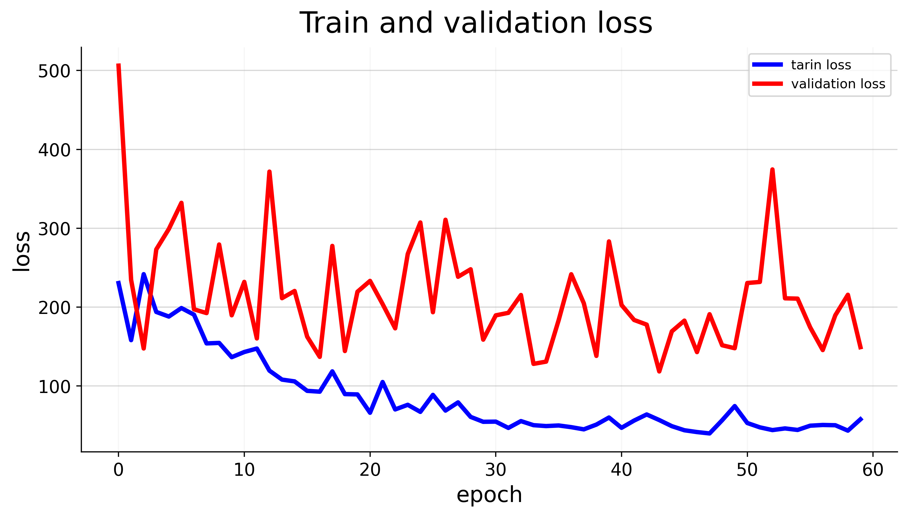
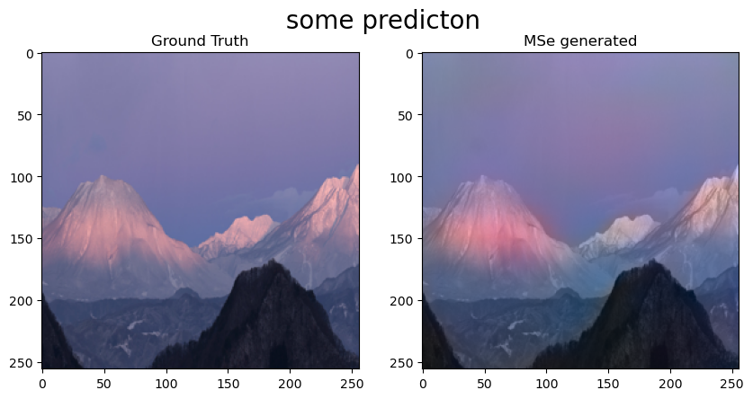
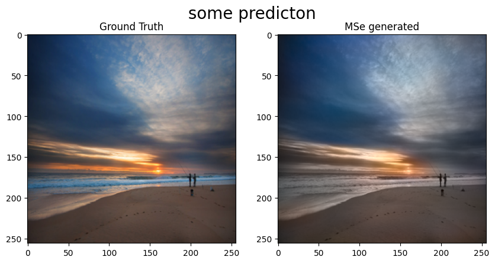

# Colorful Image Colorization Project

Welcome to the **Colorful Image Colorization** GitHub project! In this repository, you'll find an implementation of the Colorful Image Colorization technique proposed by Richard Zhang, Phillip Isola, and Alexei A. Efros. This project aims to add color to grayscale images using deep learning models.

## Project Overview

The repository includes various components and files to facilitate the colorization process:

- `config.yaml`: Configuration file containing parameters and settings for the colorization process.

- `datasets` directory: This directory holds dataset-related files or scripts.

- `nets` directory: Here, you'll find neural network architectures designed for the colorization task.

- `test_MSE.py`: A script for evaluating the colorization results using Mean Squared Error (MSE) metric.

- `utils` directory: Utility scripts and functions used throughout the colorization process.

- `Data` directory: Contains the dataset or data required for training and testing.

- `deep learning` directory: Holds scripts related to the training and evaluation of the colorization model.

- `output` directory: This is where the colorized output images are stored.

- `Train_Cross.ipynb`: A Jupyter Notebook showcasing the training process of the colorization model.

- `dataloaders` directory: Scripts and classes related to data loading and preprocessing.

- `Model` directory: This is where the trained models are saved.

- `Q1_cross.7z`: Possibly an archive file containing additional resources or data.

- `train_mse.py`: A script for training the model using the Mean Squared Error loss.

## Usage

To begin, you can explore the project's various components and scripts. The `Train_Cross.ipynb` notebook provides a detailed guide for colorization model training. You can also use the provided evaluation scripts such as `test_MSE.py` to assess the quality of the colorized images.

Feel free to modify, experiment, and adapt the provided scripts to your specific requirements. Whether you're interested in colorizing images, exploring deep learning architectures, or evaluating colorization results, this project offers valuable insights and tools.

## Acknowledgments

The **Colorful Image Colorization** project builds upon the work of Richard Zhang, Phillip Isola, and Alexei A. Efros, aiming to make colorization accessible and effective using deep learning techniques.

Explore the code and content within each directory for further understanding and context.

## Contact

If you have any questions, suggestions, or contributions related to this project or any image colorization aspect, please contact us at [iyasiniyasin98@gmail.com](mailto:iyasiniyasin98@gmail.com). Your engagement and feedback are highly appreciated!
